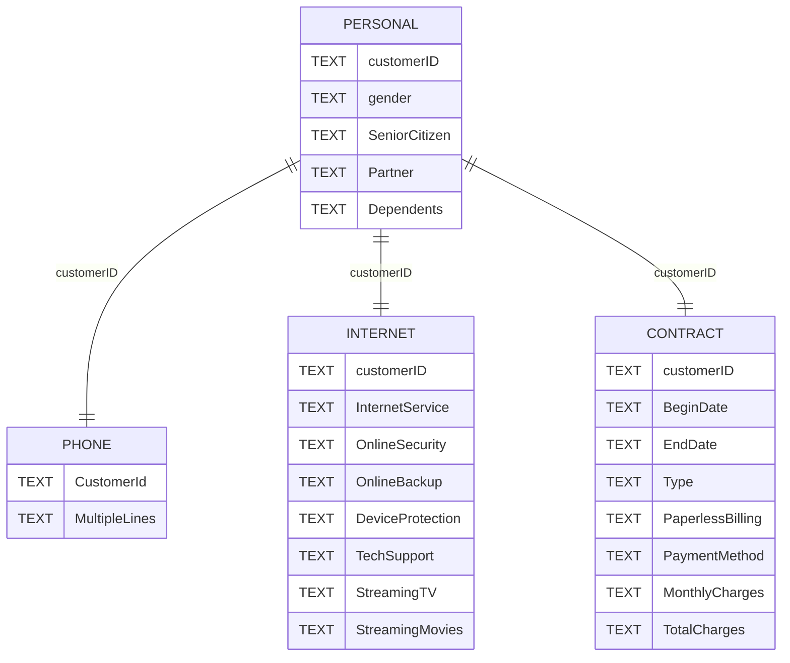

# Предсказание ухода абонента для телеком компании

## Задача
Оценка вероятности ухода клиента телеком компании

## Подходы
1. Логистическая регрессия (базовая модель);
2. DecisionTree (GridSearchCV тюнинг);
3. CatBoost (OptunaCV тюнинг);
4. Нейросеть Keras.

Метрика оценки на CV – `ROC-AUC`:
- Устойчива к дисбаллансу;
- Оценивает вне зависимости от порога разделения классов.

## План проекта
1. Изучение базы данных;
2. Выгрузка нужных для моделирования данных в pandas и их первичный осмотр;
3. Статистический анализ данных;
4. Предобработка данных;
5. Обучение и тюнинг моделей в пайплайне;
6. Кросс-валидация и выбор лучшего решения;
7. Тестирование;
8. Анализ важности признаков

## Данные
База данных sqlite

**Таблицы:**

contract — информация о договорах;

personal — персональные данные клиентов;

internet — информация об интернет-услугах;

phone — информация об услугах телефонии.

**Таблица contract**

customerID — ID абонента;

BeginDate — дата начала действия договора;

EndDate — дата окончания действия договора;

Type — тип оплаты: раз в год-два или ежемесячно;

PaperlessBilling — электронный расчётный лист;

PaymentMethod — тип платежа;

MonthlyCharges — расходы за месяц;

TotalCharges — общие расходы абонента.

**Таблица personal**

customerID — ID пользователя;

gender — пол;

SeniorCitizen — является ли абонент пенсионером;

Partner — есть ли у абонента супруг или супруга;

Dependents — есть ли у абонента дети.

**Таблица internet**

customerID — ID пользователя;

InternetService — тип подключения;

OnlineSecurity — блокировка опасных сайтов;

OnlineBackup — облачное хранилище файлов для резервного копирования данных;

DeviceProtection — антивирус;

TechSupport — выделенная линия технической поддержки;

StreamingTV — стриминговое телевидение;

StreamingMovies — каталог фильмов.

**Таблица phone**

customerID — ID пользователя;

MultipleLines — подключение телефона к нескольким линиям одновременно.

## Итоги
Метрики на CV:

  1. Логистическа] регрессия(val ROC-AUC=0.76)
  2. Древо решений(val ROC-AUC=0.78)
  3. Градиентный бустинг с подбором гиперпараметров(val ROC-AUC=0.83)
  4. Нейронная сеть(val ROC-AUC=0.82)

Метрика градиентного бустинга на тесте: ROC-AUC=0.85

## Бизнес вывод
Для прогнозирования ухода клиентов от телефонной компании наиболее критичными являются параметры, связанные с договором и оплатой услуг — длительность сотрудничества, тип оплаты и изменения в расходах. Дополнительные услуги (например, использование нескольких линий связи) также имеют значение, тогда как базовые демографические характеристики практически не влияют на результат модели. Это позволяет компании сосредоточить внимание на улучшении условий контрактов и тарифных планов, чтобы снизить отток клиентов.

Отдельно стоит заметить, что клиенты статистически склонны уходить после 3х лет контракта, возможно, следует рассмотреть эту цифру как момент повышенной актуальности персональных предложений и акций.
